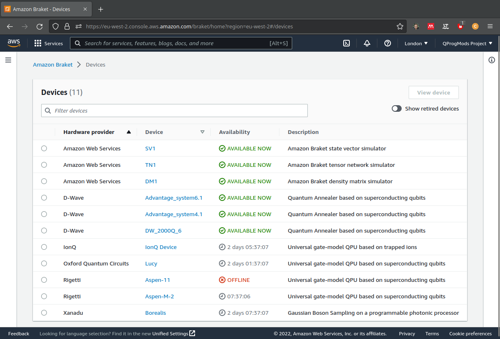
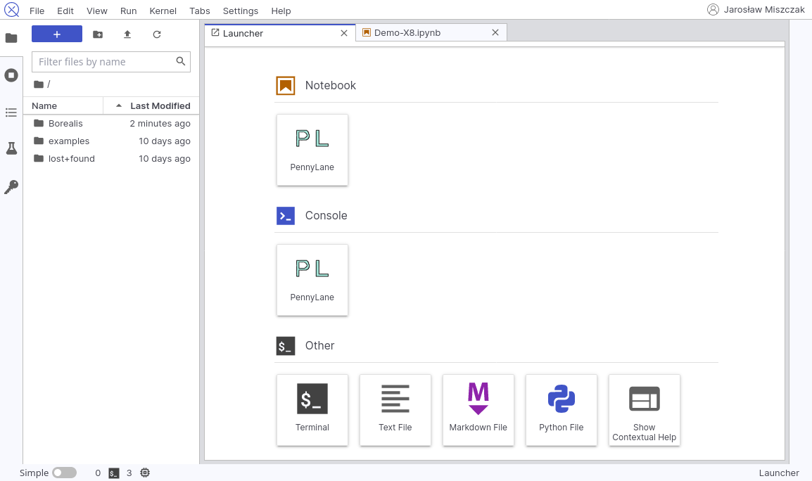
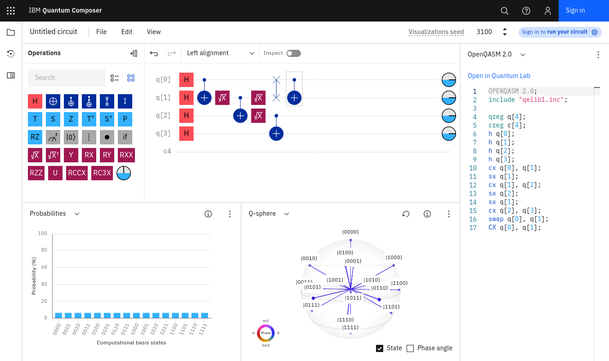
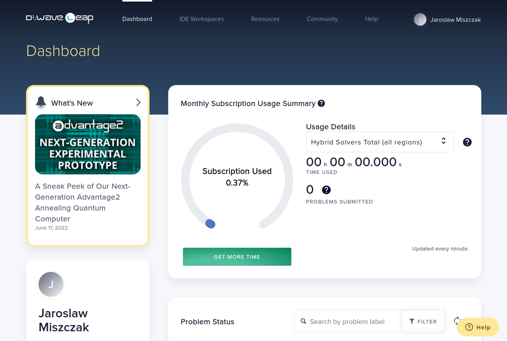
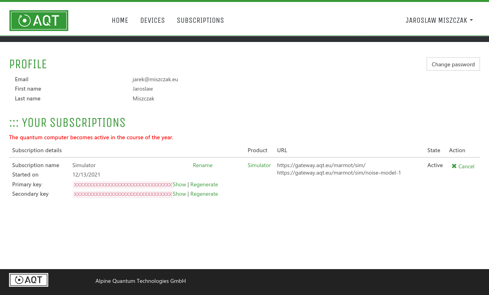

# Rozwiązania chmurowe dla obliczeń kwantowych
## Stan na październik 2022

### Streszczenie

Raport przedstawia zestawienie systemów udostępniających możliwość
wykonywania obliczeń kwantowych z poziomu chmury obliczeniowej.
Uwzględnione są zarówno rozwiązania poszczególnych firmy produkujących komputery
kwantowe jak i rozwiązania dostawców usług obliczeniowych.

### Amazon Braket

Amazon Braket to w pełni zarządzana usługa obliczeń kwantowych, która ma
pomóc w przyspieszeniu badań naukowych i rozwoju oprogramowania dla
obliczeń kwantowych. Usługa pozwala na zapoznanie się z możliwościami
programowania komputerów kwantowych i zbadać potencjalne zastosowania.
Amazon Braket zapewnia środowisko programistyczne, który można uruchomić
lokalnie na laptopie lub w pełni zarządzanym środowisku notebooków w
chmurze obliczeniowej.

W chwili obecnej Amazon Braket udostępnia urządzenia firm D-Wave, ION Q,
Oxford Quantum Circuit, Rigetti oraz Xanadu. Każde z tych urządzeń jest
zbudowane w oparciu o inny zestaw technologi i możliwości programowania.

### Google Cloud Platfrom

Google Cloud oferuje dostęp do komputera firmy IonQ w ramach usłudi
zarządzanej. Udostępniana maszyna pozwala na wykonywania obliczeń z
pamięcią kwantową 11 kubitów.

Usługi zarządzane są w pełni hostowane, zarządzane i obsługiwane przez
usługodawców. Aby korzystać z usługi konieczna jest rejestracja u
usługodawcy. Natomiast firma Google zajmuje się rozliczeniami kosztów
korzystania ze sprzętu.

Usługa ta jest dostępna poprzez wybranie jej z usług Google Cloud Marketplace. 

### Xanadu Cloud

Firma Xanadu udostępniła swój komputer w czerwcu 2022. Udostępniony
komputer to Borealis, programowalny fotoniczny komputer kwantowy z 216
kubitami w stanie ściśniętym. Maszyna ta została wykorzystana do
uzyskania czyli który przewyższa najlepsze klasyczne superkomputery w
konkretnym zadaniu, dostępny dla ludzi wszędzie poprzez Xanadu Cloud i
Amazon Braket.

Xanadau Cloud dostarcza interfejsu opartego o Jupyter Lab. Firma
dostarcza również zestawy przykładów oraz tutoriali pozwalających na
zaznajomienie się z programowaniem w bibliotece PennyLane.

### IBM Qunatum

IBM Quantum Composer i IBM Quantum Lab tworzą platformę internetową
umożliwiającą publiczny i premium dostęp do opartych na chmurze usług obliczeń
kwantowych świadczonych przez IBM Quantum. Obejmuje to dostęp do zestawu
prototypowych procesorów kwantowych IBM, zestawu samouczków dotyczących obliczeń
kwantowych oraz dostęp do interaktywnego podręcznika.

IBM Quantum pozwala również na zarządzania zasobami komputerowymi
przypisanymi do danego konta. W tej chili w podstawowej wersji
dostępnych jest sześć komputerów o maksymalnej pamięci 7 kubitów. IBM
udostępnia również specjalizowane symulatory pozwalające na testowanie
kodu kwantowego w różnych scenariuszach.

### D-Wave Systems

Oprogramowanie Ocean to pakiet narzędzi, które D-Wave Systems udostępnia na
repozytorium D-Wave GitHub do rozwiązywania trudnych problemów z wykorzystaniem
komputerów kwantowych.

Dostęp do wyżarzacza D-Wave Systems jest możliwy poprzez interfejs Leap.
Interfejs ten zapewnia kontrolę na wykorzystaniem zasobów obliczeniowych.
Dostarcza również środowiska programistycznego bazującego na VS Code oraz
zintegrowanego z GitHub i GitPod.

### IONQ

Firma IonQ, oprócz dostępu poprzez Google Cloud Platfrom, udostępnia
również narzędzie do kontrolowania kolejki wykonania procesów na
maszynie kwantowej.

Dodatkowo, możliwe jest uruchamianie zadań na komputerze IonQ z poziomu
biblioteki Qiskit.

### AQT

Firma AQT udostępnia w tej chwili symulator pułapki jonowej. Obecnie dostępne są
idealne i zaszumione symulatory do uruchamiania obwodów kwantowych. Trwają prace
nad udostępnieniem sprzętu kwantowego.

#### Źródła

1. https://www.aboutamazon.com/news/aws/aws-launches-new-quantum-computing-center, October 28, 2021
1. https://aws.amazon.com/braket/
1. https://cloud.google.com/blog/products/compute/ionq-quantum-computer-available-through-google-cloud, June 18, 2021
1. https://cloud.xanadu.ai/
1. https://www.xanadu.ai/press/xanadu-launches-first-public-cloud-deployed-computer-with-quantum-computational-advantage, June 1, 2022
1. L.S. Madse, et al., Quantum computational advantage with a programmable photonic processor, Nature, 606, pages 75–81 (2022), https://doi.org/10.1038/s41586-022-04725-x
1. https://pennylane.ai/
1. https://cloud.dwavesys.com/leap/
1. https://www.gitpod.io/
1. https://www.ibm.com/quantum
1. https://quantum-computing.ibm.com
1. https://cloud.ionq.com
1. https://gateway-portal.aqt.eu/
