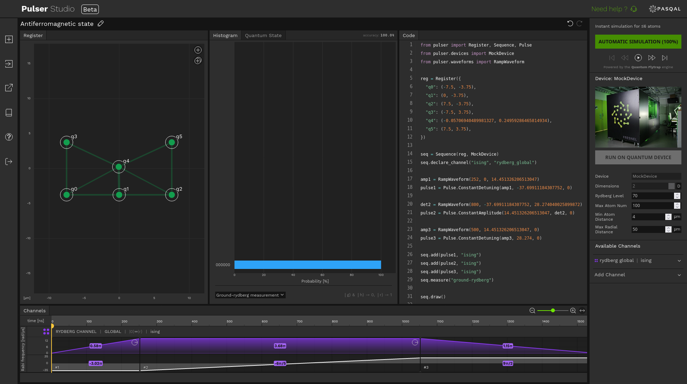
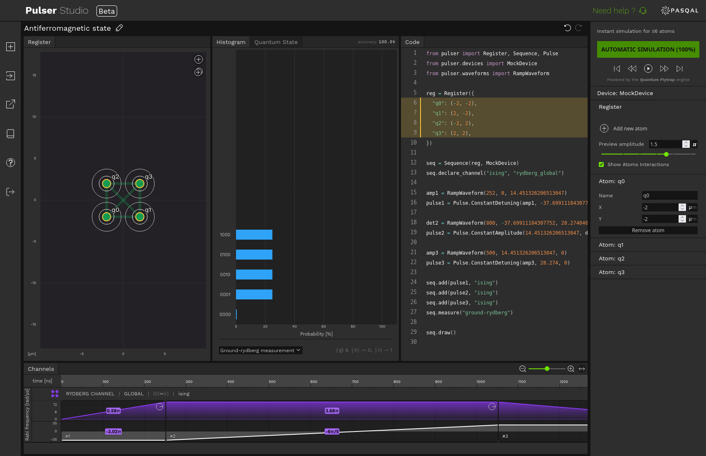
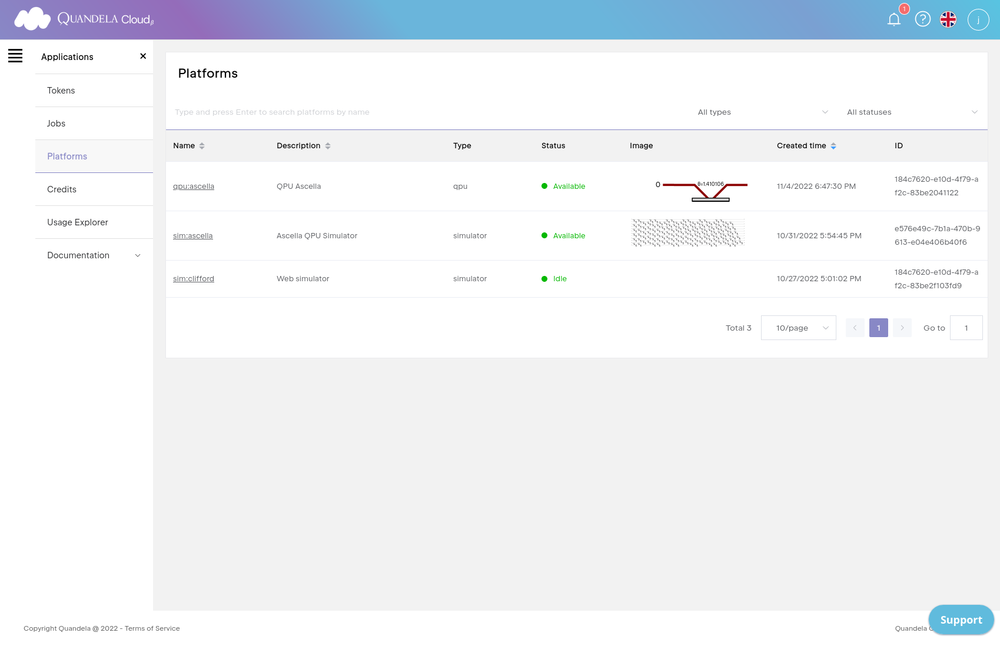
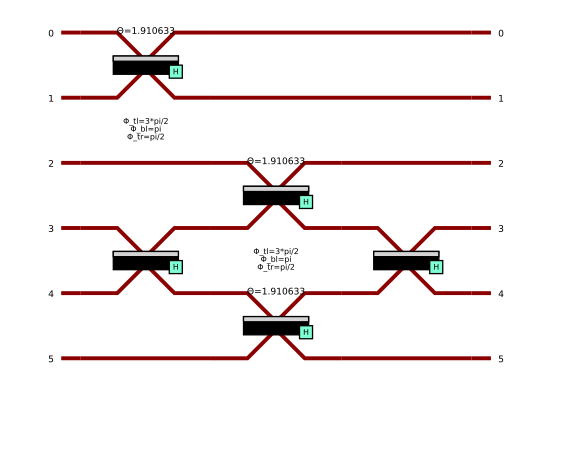

# Rozwiązania chmurowe dla obliczeń kwantowych
## Platformy wykorzystujące komputery fotoniczne i atomy neutralne

### Streszczenie

Raport przedstawia przegląd systemów porgramowania komputerów kwantowych dedykowanych dla sprzętu bazującego na obliczeniach optycznych oraz na automach neutalnych. Zaprezenowane są rozwiązanie dwóch firm produkujących tego typu urządzenia oraz oferujących dostęp do opogramowanie dedykowanego do obsługi dedykowanych systemów.  Przedstawione są również przykłady wykorzystania opisywanych platfrom w zastosowaniu do algorytmów dla komputerów kwantowych najbliższej przyszłości.

### Platforma Pulser Studio firmy Pasqal 

#### Podstawowe cechy

Pulser Studio to platforma firmy Pasqal, która umożliwia użytkownikom projektowanie, symulowanie i uruchamianie algorytmów kwantowych na urządzeniach kwantowych tworzonych przez tą firmę. Platforma Pulser Studio pozwala na tworzenie programów kwantowych przy użyciu języka programowania Python, który jest jednym z najpopularniejszych języków programowania w dziedzinie kwantowych obliczeń. Pulser Studio umożliwia tworzenie sekwencji impulsów, które są potrzebne do wykonania obliczeń kwantowych na urządzeniach kwantowych firmy Pasqal.



Pulser Studio zapewnia narzędzia do symulacji obliczeń kwantowych na komputerze klasycznym przed ich uruchomieniem na urządzeniu kwantowym. Rozszerzenie ```pulser_simulation``` dostarcza narzędzi do klasycznej symulacji (z wykorzystaniem bibliotek QuTiP), aby wspomóc rozwój i testowanie nowych sekwencji impulsów. To umożliwia użytkownikom testowanie i optymalizowanie swoich algorytmów przed ich implementacją na rzeczywistych urządzeniach kwantowych.


#### Zasada działania

Pulser został zaprojektowany tak, aby umożliwić użytkownikom tworzenie eksperymentów dostosowanych do konkretnych urządzeń z neutralnym atomem. Zmniejsza to poziom abstrakcji i daje maksymalną elastyczność i kontrolę nad zachowaniem odpowiednich parametrów fizycznych, w granicach wyznaczonych przez wybrane urządzenie.

W konsekwencji oprogramowaie Pulser wyłamuje się z paradygmatu cyfrowych obliczeń kwantowych i umożliwia również tworzenie analogowych symulacji kwantowych, które wykraczają poza tradycyjne podejście do tworzenia obwodów kwantowych. Niezależnie od rodzaju eksperymentu lub paradygmatu, jeśli można go wykonać na urządzeniu, można go wykonać za pomocą Pulsera.




```
from pulser import Register, Sequence, Pulse
from pulser.devices import MockDevice
from pulser.waveforms import RampWaveform

reg = Register({
  "q0": (-2, -2),
  "q1": (2, -2),
  "q2": (-2, 2),
  "q3": (2, 2),
})

seq = Sequence(reg, MockDevice)
seq.declare_channel("ising", "rydberg_global")

amp1 = RampWaveform(252, 0, 14.451326206513047)
pulse1 = Pulse.ConstantDetuning(amp1, -37.69911184307752, 0)

det2 = RampWaveform(800, -37.69911184307752, 28.274040025899872)
pulse2 = Pulse.ConstantAmplitude(14.451326206513047, det2, 0)

amp3 = RampWaveform(500, 14.451326206513047, 0)
pulse3 = Pulse.ConstantDetuning(amp3, 28.274, 0)

seq.add(pulse1, "ising")
seq.add(pulse2, "ising")
seq.add(pulse3, "ising")
seq.measure("ground-rydberg")

seq.draw()
```

####

Dodatkowo platforma Pulser Studio udostępnia narzędzia do monitorowania i debugowania stanu pracy urządzenia kwantowego w czasie rzeczywistym. Umożliwia to użytkownikom lepszą kontrolę nad zadaniamia obliczeniowymi przesłanymi do komputera kwantowego.

Pulser Studio jest zintegrowany z chmurą kwantową firmy Pasqal, co umożliwia użytkownikom dostęp do wysokiej jakości urządzeń kwantowych i zapewnia wysoką skalowalność.


### Platforma firmy Quandela

Komputery kwantowe firmy Quandela opierają się na manipulacji światłem za pomocą układów fotonicznych.

#### Quandela Cloud




#### Parceval

Parceval to oprogramowanie opracowane przez firmę Quandela do programowania i sterowania kwantowycmi komputerami fotonicznymi. Parceval został stworzony w celu ułatwienia procesu programowania i obsługi tych złożonych systemów, aby umożliwić użytkownikom skupienie się na projektowaniu i przeprowadzaniu eksperymentów na komputerach fotonicznych.

Oprogramowanie Parseval umożliwia użytkownikom tworzenie programów obliczeniowych za pomocą języków programowania, takich jak Python i C++, które następnie mogą być przesłane do komputera kwantowego lub fotonicznego firmy Quandela. Parseval umożliwia również użytkownikom tworzenie schematów logicznych i grafów obliczeniowych, które mogą być wykorzystane do przeprowadzania obliczeń na komputerze kwantowym lub fotonicznym.

Parseval jest również wyposażony w funkcje do debugowania i testowania kodu, co umożliwia użytkownikom szybkie iterowanie i poprawianie kodu. Parseval oferuje również narzędzia do wizualizacji danych i wyników obliczeń, co umożliwia użytkownikom analizę i interpretację wyników.


```
import perceval as pcvl
import sympy as sp
import numpy as np

cnot = pcvl.Circuit(6, name="Ralph CNOT")
cnot.add((0, 1), pcvl.BS.H(pcvl.BS.r_to_theta(1/3), phi_tl = -np.pi/2, phi_bl = np.pi, phi_tr = np.pi / 2))
cnot.add((3, 4), pcvl.BS.H())
cnot.add((2, 3), pcvl.BS.H(pcvl.BS.r_to_theta(1/3), phi_tl = -np.pi/2, phi_bl = np.pi, phi_tr = np.pi / 2))
cnot.add((4, 5), pcvl.BS.H(pcvl.BS.r_to_theta(1/3)))
cnot.add((3, 4), pcvl.BS.H())
pcvl.pdisplay(cnot)
```




#### Źródła

1. https://www.insidequantumtechnology.com/news-archive/pasqal-rolls-out-no-code-development-platform-pulser-studio/
1. Exploring the Features of Pulser Studio, https://www.pasqal.com/articles/pulser-s-1, 06/01/2023
1. Silvério, Henrique, Sebastián Grijalva, Constantin Dalyac, Lucas Leclerc, Peter J. Karalekas, Nathan Shammah, Mourad Beji, Louis-Paul Henry, and Loïc Henriet. "Pulser: An open-source package for the design of pulse sequences in programmable neutral-atom arrays." Quantum 6 (2022): 629.https://quantum-journal.org/papers/q-2022-01-24-629/
1. https://pulserstudio.pasqal.cloud/
1. https://github.com/pasqal-io/Pulser
1. https://cloud.quandela.com/
1. Heurtel, Nicolas, Andreas Fyrillas, Grégoire de Gliniasty, Raphaël Le Bihan, Sébastien Malherbe, Marceau Pailhas, Eric Bertasi et al. "Perceval: A software platform for discrete variable photonic quantum computing." Quantum 7 (2023): 931. https://quantum-journal.org/papers/q-2023-02-21-931/


